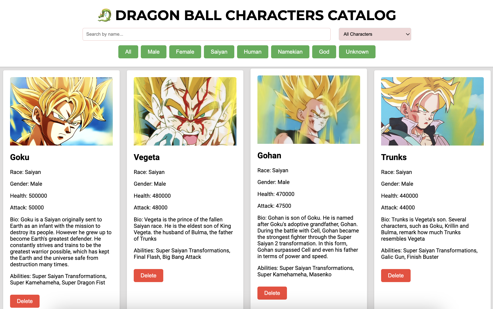

# SEA Stage 2 - Data Catalog Project &#128075;

Project done by Buyantogtokh Khurelbaatar for Snap Engineering Academy.

## My project:

<h3 align="center">&#128009; Dragon Ball Characters Catalog Page &#128009;</h1>

> [!NOTE]
> Made on Vanilla Javascript due to assesment guidelines. 

## Summary

 This web application is a characters catalog featuring a dynamic user interface for browsing and searching through a list of characters from the Dragon Ball series. Users can search for characters by name, sort them based on health or attack points, and filter them by categories such as gender and race. Each character is displayed with their name, race, gender, health points, attack points, biography, abilities, and a photo.

## Resources & Tools
- Data set created by me, 12 different characters from the series Dragon Ball. Each character's information is stored as an object with key-value pairs representing different attributes.
- Google Fonts 
- HTML, CSS, Javascript

## Contact
Buyantogtokh Khurelbaatar [LinkedIn](https://www.linkedin.com/in/khurel/) - vicekurel@gmail.com 